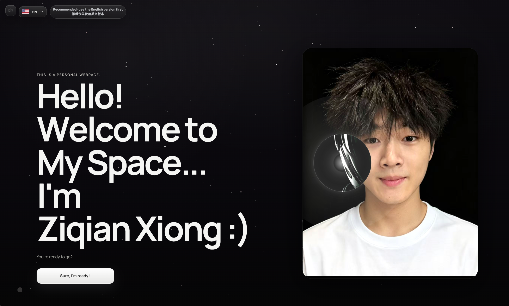

# 熊子谦 | 个人简历与作品集

[English](README.md) | [中文]

这是熊子谦的个人网站。我目前就读于宁波诺丁汉大学计算机科学专业。网站以双语和动态视觉为主要表现方式，集中展示我的学术经历、校园生活、舞蹈内容和联系方式。

[**进入网站**](https://qqqqqprofile.vercel.app)



## 页面说明

| 页面 | 路由 | 用途 |
| --- | --- | --- |
| Profile | `/profile` | 展示我的非学术背景，包括基本个人信息、校内外参加的活动，以及个人照片集。 |
| Academic | `/experience` | 展示我的学术背景，包括工作经历、科研经历、项目经历、成绩和已完成的课程。 |
| Dance Videos | `/dance` | 展示我的舞蹈视频和相关内容，包括表演视频、Battle、Cypher 以及其他舞蹈内容。 |
| Contact | `/contact` | 提供我的联系方式，包括 GitHub、E-mail 和 WeChat。 |

首页（`/`）用于介绍网站，并允许访客选择英文或中文。`/ready` 是由首页 CTA 打开的内部页面选择器。访问未知路由时，网站会重定向到首页。

更多页面和功能仍在持续开发中。

## 功能

- 提供英文和中文内容，并支持统一的语言切换。
- 提供全站共享背景音乐和静音控制。
- 使用 GSAP 和 Motion 实现动态交互效果。
- 包含 Three.js 联系地球和基于 WebGL 的交互视觉效果。
- 提供校园活动、个人照片和舞蹈内容的媒体画廊。

## 项目结构

```text
.
|-- public/                         # Vite 直接提供的静态文件
|   |-- media/
|   |   |-- audio/                  # 背景音乐文件
|   |   |-- contact-globe/          # 地球纹理和地理数据
|   |   |-- images/                 # 画廊、活动、舞蹈和 README 图片
|   |   `-- video/                  # 浏览器兼容的视频文件
|   |-- favicon.svg                 # 浏览器标签页图标
|   `-- icons.svg                   # 共享 SVG 图标精灵
|-- src/                            # 应用源代码
|   |-- assets/                     # 通过 Vite 模块图导入的媒体资源
|   |-- components/                 # 可复用的界面、动画、音频和 3D 组件
|   |-- content/                    # 页面数据和双语文案
|   |-- pages/                      # 路由级 React 页面
|   |-- styles/                     # 全局和应用级 CSS
|   |-- App.jsx                     # 应用路由和页面组合
|   `-- main.jsx                    # React 入口文件
|-- codex-work/                     # 本地 Agent 笔记、日志、截图和临时文件（已忽略）
|-- dist/                           # 生成的生产构建目录（已忽略）
|-- .gitignore                      # Git 忽略规则
|-- eslint.config.js                # ESLint 配置
|-- index.html                      # Vite HTML 入口文档
|-- LICENSE                         # 复用和授权条款
|-- package.json                    # 项目脚本和依赖
|-- vercel.json                     # Vercel SPA 重写配置
`-- vite.config.js                  # Vite 配置
```

## 技术栈

- React 18 和 React Router 6
- Vite 5
- Three.js、React Three Fiber、Drei 和 OGL
- GSAP 和 Motion
- ESLint 9，以及 React 和 React Hooks 规则

## Quick Start

### 环境要求

- Node.js 18 或更高版本
- npm

### 在本地运行

```bash
git clone https://github.com/qianqqqqqXZQ/My_Profile.git
cd My_Profile
npm install
npm run dev
```

打开 Vite 输出的本地地址，通常是 [http://localhost:5173](http://localhost:5173)。

### 可用命令

```bash
npm run dev      # 启动本地开发服务器
npm run lint     # 使用 ESLint 检查源代码
npm run build    # 在 dist/ 中生成生产构建
npm run preview  # 在本地预览生产构建
```

## 内容和媒体资源

- 在 `src/content/siteContent.js` 中更新页面内容和双语文案。
- 将直接提供的媒体资源放入 `public/media/`，并使用 `/media/...` 路径引用。
- 将由 React 组件导入的资源放入 `src/assets/`。
- Vercel 配置会将请求回退到 `index.html`，因此使用 React Router 的页面在直接访问或刷新时仍然可以正常工作。

## 开发 Todo

- [x] 在 Vercel 上部署网站。
- [x] 开发中英文双版本。
- [ ] 开启舞蹈视频集合的直接浏览和播放功能。

## License

本项目遵循 [LICENSE](LICENSE) 中的自定义授权条款。未经作者事先知晓并获得书面许可，不得复用本网站的结构、布局、源代码或视觉设计。
